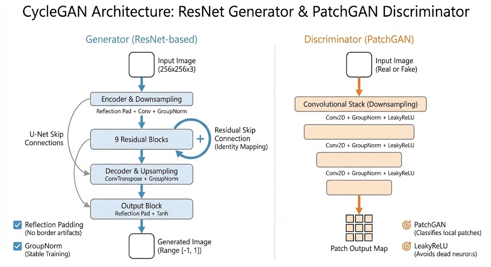
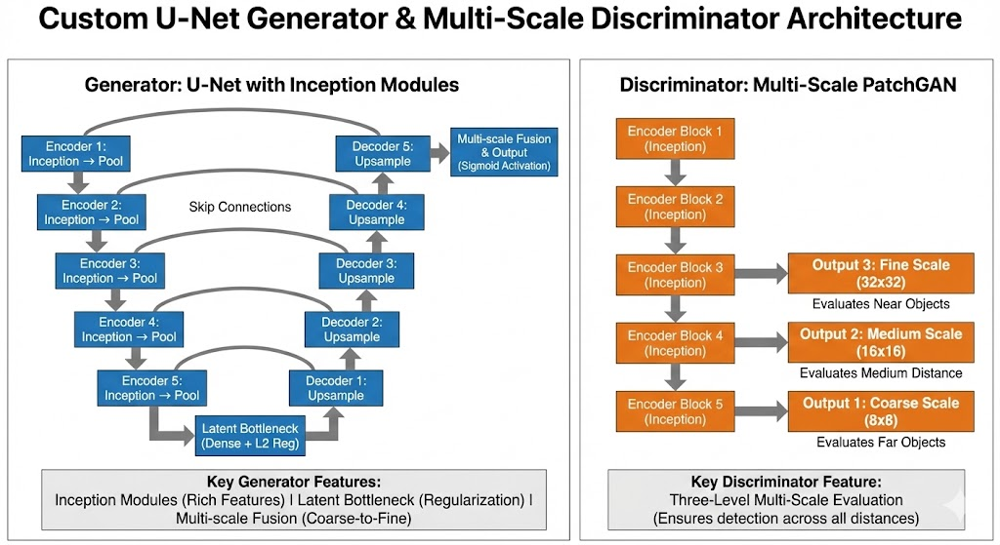

# So Sánh Chi Tiết Hai Mô Hình CycleGAN cho Chuyển Đổi Ảnh Đêm sang Ban Ngày

## Tóm Tắt

Bài viết này trình bày phân tích so sánh chi tiết hai phương pháp chuyển đổi ảnh đêm sang ảnh ban ngày dựa trên kiến trúc CycleGAN (Cycle-Consistent Generative Adversarial Networks). Hai phương pháp được nghiên cứu bao gồm:

1. **CycleGAN với ResNet Generator** - Kiến trúc chuẩn sử dụng Residual blocks
2. **Multi-Scale CycleGAN** - Kiến trúc tùy chỉnh với multi-scale discriminator

Cả hai mô hình đều được huấn luyện và đánh giá trên tập dữ liệu BDD100K (Berkeley DeepDrive Dataset).

---

## 1. CycleGAN with ResNet Generator

### Kiến Trúc Mô Hình


*Hình 1: Sơ đồ kiến trúc tổng thể của CycleGAN với ResNet Generator*

#### Generator (ResNet-based U-Net)

**Thông số cơ bản:**
- Input shape: `256×256×3`
- Base filters: `64`
- Kiến trúc: Encoder-Decoder với Residual blocks

**Cấu trúc chi tiết:**

```
Input (256×256×3)
    ↓
Reflection Padding + Conv2D(64, 7×7) + GroupNorm + ReLU
    ↓
Downsampling (2 blocks)
├─ Conv2D(128, 3×3, stride=2) + GroupNorm + ReLU
└─ Conv2D(256, 3×3, stride=2) + GroupNorm + ReLU
    ↓
Residual Blocks (9 blocks)
├─ [ReflectionPad → Conv2D → GroupNorm → ReLU]
├─ [ReflectionPad → Conv2D → GroupNorm]
└─ Add with input (skip connection)
    ↓
Upsampling (2 blocks)
├─ Conv2DTranspose(128, 3×3, stride=2) + GroupNorm + ReLU
└─ Conv2DTranspose(64, 3×3, stride=2) + GroupNorm + ReLU
    ↓
Reflection Padding + Conv2D(3, 7×7)
    ↓
Tanh activation
    ↓
Output (256×256×3) range: [-1, 1]
```

**Đặc điểm nổi bật:**
- **Reflection Padding**: Giảm thiểu artifacts tại biên ảnh
- **Residual Blocks**: Hỗ trợ học identity mapping và ổn định quá trình huấn luyện
- **GroupNormalization** (groups=-1): Tương đương với Instance Normalization
- **Skip connections**: Bảo toàn thông tin chi tiết từ encoder đến decoder

#### Discriminator (PatchGAN)

**Thông số:**
- Base filters: `64`
- Kernel size: `4×4`
- Downsampling blocks: `3`

**Cấu trúc:**

```
Input (256×256×3)
    ↓
Conv2D(64, 4×4, stride=2) + LeakyReLU(0.2)
    ↓
Conv2D(128, 4×4, stride=2) + GroupNorm + LeakyReLU(0.2)
    ↓
Conv2D(256, 4×4, stride=2) + GroupNorm + LeakyReLU(0.2)
    ↓
Conv2D(512, 4×4, stride=1) + GroupNorm + LeakyReLU(0.2)
    ↓
Conv2D(1, 4×4, stride=1)
    ↓
Output: Patch-based classification
```

**Đặc điểm:**
- **PatchGAN**: Đánh giá tính real/fake theo từng patch thay vì toàn bộ ảnh
- **LeakyReLU**: Ngăn ngừa hiện tượng dead neurons trong quá trình huấn luyện

### 🎓 Training Configuration

#### Loss Functions

```python
# 1. Generator Adversarial Loss
L_adv = MSE(ones, D(G(x)))

# 2. Cycle Consistency Loss (λ_cycle = 10.0)
L_cycle = MAE(x, F(G(x))) + MAE(y, G(F(y)))
L_cycle_weighted = L_cycle × 10.0

# 3. Identity Loss (λ_identity = 0.5)
L_identity = MAE(y, G(y)) + MAE(x, F(x))
L_identity_weighted = L_identity × 10.0 × 0.5

# 4. Total Generator Loss
L_G_total = L_adv + L_cycle_weighted + L_identity_weighted

# 5. Discriminator Loss
L_D = MSE(ones, D(real)) + MSE(zeros, D(fake))
```

#### Hyperparameters

| Parameter | Value |
|-----------|-------|
| **Batch Size** | 1 |
| **Image Size** | 256×256 |
| **Learning Rate** | 2e-4 |
| **Optimizer** | Adam (β₁=0.5, β₂=0.999) |
| **Epochs** | 100 |
| **λ_cycle** | 10.0 |
| **λ_identity** | 0.5 |
| **Dataset** | BDD100K |
| **Train samples** | 1200 per domain |
| **Test samples** | 400 per domain |

#### Data Preprocessing

```python
# Training augmentation
- Random horizontal flip
- Resize to 720×720
- Random crop to 256×256
- Normalize: (img/127.5) - 1

# Test preprocessing
- Resize to 256×256
- Normalize: (img/127.5) - 1
```

---

## 2. Multi-Scale CycleGAN

### Kiến Trúc Mô Hình


*Hình 2: Sơ đồ kiến trúc tổng thể của Multi-Scale CycleGAN*

#### Generator (Custom U-Net with Inception Modules)

**Thông số cơ bản:**
- Input shape: `256×256×3`
- Base filters: `16`
- Kernel size: `5×5` (toàn bộ)
- Kiến trúc: U-Net với Inception modules

**Inception Module:**

```python
def inceptionModule(inputs, filter):
    x1 = Conv2D(filter, 5×5, dilation=1) → Activation → GroupNorm
    x2 = Conv2D(filter, 5×5, dilation=1) → Activation → GroupNorm
    x3 = Conv2D(filter, 5×5, dilation=1) → Activation → GroupNorm
    return x3
```

**Cấu trúc Generator:**

```
Input (256×256×3)
    ↓
Encoder Block 1: InceptionModule(16) → MaxPool → (128×128×16)
    ↓ skip1
Encoder Block 2: InceptionModule(32) → MaxPool → (64×64×32)
    ↓ skip2
Encoder Block 3: InceptionModule(64) → MaxPool → (32×32×64)
    ↓ skip3
Encoder Block 4: InceptionModule(128) → MaxPool → (16×16×128)
    ↓ skip4
Encoder Block 5: InceptionModule(256) → MaxPool → (8×8×256)
    ↓ skip5
Latent Space:
├─ Flatten
├─ Dense(128, L2=0.001) ← Bottleneck
├─ Dense(8×8×256, L2=0.001)
└─ Reshape(8×8×256)
    ↓
Decoder Block 1: Upsample + skip5 + InceptionModule(256) → (16×16×256)
    ↓
Decoder Block 2: Upsample + skip4 + InceptionModule(128) → (32×32×128)
    ↓
Decoder Block 3: Upsample + skip3 + InceptionModule(64) → (64×64×64)
    ↓
Decoder Block 4: Upsample + skip2 + InceptionModule(32) → (128×128×32)
    ↓
Decoder Block 5: Upsample + skip1 + InceptionModule(16) → (256×256×16)
    ↓
Multi-scale Fusion:
├─ Conv2DTranspose(16, stride=16) from Decoder Block 1
└─ Concatenate with Decoder Block 5
    ↓
Conv2DTranspose(3, 5×5, stride=1)
    ↓
Sigmoid activation
    ↓
Output (256×256×3) range: [0, 1]
```

**Đặc điểm nổi bất:**
- **Inception Modules**: Sử dụng multiple convolutions để học các đặc trưng phong phú hơn
- **Latent Bottleneck**: Dense layer với 128 units và L2 regularization
- **Multi-scale Fusion**: Kết hợp đặc trưng từ các decoder layers ở độ sâu khác nhau
- **Large Kernel (5×5)**: Mở rộng receptive field để học quan hệ không gian xa hơn

#### Discriminator (Multi-Scale PatchGAN)

**Đặc điểm độc đáo:**
- **3 outputs ở các scales khác nhau**: Cho phép đánh giá ở multiple resolutions
- **Kernel size**: 5×5 (lớn hơn kernel chuẩn 3×3 hoặc 4×4)

**Cấu trúc:**

```
Input (256×256×3)
    ↓
Encoder Block 1: InceptionModule(16) → MaxPool → (128×128×16)
    ↓
Encoder Block 2: InceptionModule(32) → MaxPool → (64×64×32)
    ↓
Encoder Block 3: InceptionModule(64) → MaxPool → (32×32×64) ─┐
    ↓                                                          │
Encoder Block 4: InceptionModule(128) → MaxPool → (16×16×128) ┤
    ↓                                                          │
Encoder Block 5: InceptionModule(256) → MaxPool → (8×8×256)   │
    ↓                                                          ↓
Output 1: Conv2D(1, 5×5) → (8×8×1)   ← Coarse scale (objects xa)
    ↓                                                          ↓
Output 2: Conv2D(1, 5×5) → (16×16×1) ← Medium scale
    ↓                                                          ↓
Output 3: Conv2D(1, 5×5) → (32×32×1) ← Fine scale (objects gần)
```

**Ý nghĩa Multi-Scale:**
- **Scale 1 (8×8)**: Đánh giá tổng thể cảnh quan và các đối tượng ở khoảng cách xa
- **Scale 2 (16×16)**: Đánh giá các đối tượng ở khoảng cách trung bình
- **Scale 3 (32×32)**: Đánh giá chi tiết các đối tượng ở khoảng cách gần

**Lợi ích:**

Discriminator cần có khả năng nhận diện các đối tượng ở mọi khoảng cách trong ảnh. Trong ngữ cảnh lái xe tự động, các đối tượng xuất hiện ở nhiều khoảng cách khác nhau từ camera. Kiến trúc multi-scale cho phép discriminator đánh giá chất lượng ảnh sinh ra một cách hiệu quả ở tất cả các mức độ chi tiết.

### 🎓 Training Configuration

#### Loss Functions

```python
# Discriminator có 3 outputs → 3 losses
L_D_source = MSE_scale1 + MSE_scale2 + MSE_scale3
L_D_target = MSE_scale1 + MSE_scale2 + MSE_scale3

# Generator adversarial loss (3 scales)
L_adv_target = MSE_scale1 + MSE_scale2 + MSE_scale3
L_adv_source = MSE_scale1 + MSE_scale2 + MSE_scale3

# Cycle consistency
L_cycle = MAE(x, F(G(x))) × 10 + MAE(y, G(F(y))) × 10

# Identity
L_identity = MAE(y, G(y)) × 0.5 + MAE(x, F(x)) × 0.5

# Total GAN loss
L_GAN_total = L_adv × 1 + L_cycle × 10 + L_identity × 0.5
```

**Loss weights:**
```python
loss_weights = [
    1, 1, 1,      # d_target_re scales 1,2,3
    1, 1, 1,      # d_source_re scales 1,2,3
    10, 10,       # cycle consistency (forward, backward)
    0.5, 0.5      # identity (source, target)
]
```

#### Hyperparameters

| Parameter | Value |
|-----------|-------|
| **Batch Size** | 4 |
| **Image Size** | 256×256 |
| **Learning Rate (Discriminator)** | 1e-4 |
| **Learning Rate (Generator)** | 5e-5 |
| **Optimizer** | Adam |
| **Weight Decay** | 6e-8 |
| **Epochs** | 30,000 |
| **Base Filters** | 16 |
| **Kernel Size** | 5×5 |
| **Dataset** | BDD100K |
| **Checkpoint Interval** | Every 2000 epochs |
| **Image Logging** | Every 1000 epochs |

#### Data Preprocessing

```python
# Simple preprocessing
- Resize to 256×256
- Normalize: img/255 (range [0,1])
```

#### Training với Weights & Biases

```python
wandb.init(
    project="night2day-cyclegan",
    config={
        "epochs": 30000,
        "batch_size": 4,
        "learning_rate": 0.0001,
        "architecture": "Multi-Scale CycleGAN"
    }
)

# Tracked metrics
- Discriminator losses (source, target, 3 scales each)
- Generator losses (source, target, 3 scales each)
- Cycle consistency losses
- Identity losses
- Generated images every 1000 epochs
- Auto-backup checkpoints mỗi 2000 epochs
```

**Các tính năng của Weights & Biases:**
- Real-time loss tracking
- Tự động lưu checkpoints lên cloud
- Trực quan hóa ảnh được sinh ra
- Tự động khôi phục training khi Kaggle timeout
- So sánh nhiều lần chạy thí nghiệm

---

## So Sánh Chi Tiết


*Hình 3: So sánh trực quan giữa hai kiến trúc CycleGAN*

### Kiến Trúc

| Aspect | ResNet CycleGAN | Multi-Scale CycleGAN |
|--------|-----------------|----------------------|
| **Generator Base** | ResNet blocks | Inception modules |
| **Generator Filters** | 64 → 256 | 16 → 256 |
| **Generator Kernel** | 3×3, 4×4, 7×7 | 5×5 (uniform) |
| **Latent Space** | Không có | Dense(128) + L2 reg |
| **Multi-scale Fusion** | Không có | Skip từ deep decoder |
| **Output Activation** | tanh [-1,1] | sigmoid [0,1] |
| **Discriminator Type** | Single-scale PatchGAN | Multi-scale PatchGAN |
| **Discriminator Outputs** | 1 | 3 (scales: 8×8, 16×16, 32×32) |
| **Discriminator Kernel** | 4×4 | 5×5 |

### Training

| Aspect | ResNet CycleGAN | Multi-Scale CycleGAN |
|--------|-----------------|----------------------|
| **Batch Size** | 1 | 4 |
| **Learning Rate** | 2e-4 | 1e-4 (D), 5e-5 (G) |
| **Epochs** | 100 | 30,000 |
| **Training Time** | ~Few hours | ~Days/Weeks |
| **Data Augmentation** | Heavy (flip, crop) | Light (resize only) |
| **Normalization** | [-1, 1] | [0, 1] |
| **Optimizer** | Adam (β₁=0.5) | Adam (default β) |
| **Monitoring** | Manual callbacks | WandB cloud tracking |
| **Checkpointing** | Local only | Local + Cloud |

### Loss Functions

| Loss Component | ResNet CycleGAN | Multi-Scale CycleGAN |
|----------------|-----------------|----------------------|
| **Adversarial** | MSE | MSE (×3 scales) |
| **Cycle Consistency** | MAE × 10 | MAE × 10 |
| **Identity** | MAE × 5 | MAE × 0.5 |
| **Regularization** | Không có | L2 (0.001) trong latent space |
| **Total Losses** | 4 | 10 (3 scales × 2 + cycle + identity) |

---

## Ưu Nhược Điểm

### ResNet CycleGAN

**Ưu điểm:**
- **Kiến trúc đã được chứng minh**: Dựa trên các nghiên cứu đã công bố và kiểm chứng
- **Thời gian huấn luyện ngắn**: Chỉ cần 100 epochs
- **Ổn định**: Residual blocks hỗ trợ gradient flow hiệu quả
- **Reflection padding**: Giảm thiểu artifacts tại biên ảnh
- **Dễ triển khai**: Code đơn giản, dễ hiểu và bảo trì
- **Tiết kiệm tài nguyên**: Batch size 1, yêu cầu RAM thấp

**Nhược điểm:**
- **Single-scale discriminator**: Hạn chế trong xử lý đối tượng ở nhiều khoảng cách khác nhau
- **Data augmentation hạn chế**: Độ đa dạng dữ liệu chưa cao
- **Không có latent regularization**: Không ép buộc học compact representation
- **Thời gian huấn luyện ngắn**: 100 epochs có thể chưa đủ để đạt convergence tối ưu

### Multi-Scale CycleGAN

**Ưu điểm:**
- **Multi-scale discriminator**: Xử lý hiệu quả các đối tượng ở mọi khoảng cách
- **Large kernel (5×5)**: Mở rộng receptive field cho việc học quan hệ không gian
- **Latent bottleneck**: Ép buộc học compact và meaningful representation
- **Multi-scale fusion**: Kết hợp đặc trưng ở nhiều mức độ chi tiết
- **Tích hợp WandB**: Theo dõi metrics, tự động khôi phục, sao lưu cloud
- **Huấn luyện kéo dài**: 30,000 epochs đảm bảo convergence tốt hơn
- **Batch size 4**: Ước lượng gradient ổn định hơn

**Nhược điểm:**
- **Thời gian huấn luyện dài**: Yêu cầu 30,000 epochs
- **Phức tạp**: Khó debug và có nhiều hyperparameters cần điều chỉnh
- **Yêu cầu tài nguyên cao**: Cần GPU mạnh và thời gian huấn luyện lâu
- **Nguy cơ overfitting**: Training quá lâu có thể dẫn đến overfitting
- **3 discriminator outputs**: Tính toán loss phức tạp hơn

---

## Thiết Kế Đặc Biệt cho Bài Toán Night-to-Day

### Triết Lý Multi-Scale Discriminator

**Vấn đề:**

Trong ảnh lái xe ban đêm, một số đối tượng có thể rất tối do thiếu ánh sáng, chỉ một phần nhỏ của đối tượng có thể quan sát được. Discriminator cần học cách đánh giá chính xác việc tái tạo đối tượng ban ngày từ thông tin hạn chế này.

**Giải pháp:**

1. **Kernel 5×5**: 
   - Mỗi pixel được đánh giá với context của 24 neighbors (5×5-1)
   - Học được "pixel này với neighbors của nó có hợp lý không?"
   - Tốt hơn kernel 3×3 cho việc reconstruct từ partial info

2. **3 Scales**:
   - **8×8 (coarse)**: Objects xa camera (xe phía xa, biển báo xa)
   - **16×16 (medium)**: Objects khoảng cách trung bình
   - **32×32 (fine)**: Objects gần camera (đường phía trước, xe ngay cạnh)

3. **Inception Modules**:
   - 3 convolutions liên tiếp → học features ở multiple levels
   - Kết hợp với 1×1 conv (residual) → skip useless transformations

### Latent Space Regularization

```python
x = Flatten(conv5)
x = Dense(128, L2=0.001)  ← Force compact representation
x = Dense(original_size, L2=0.001)
x = Reshape(...)
```

**Mục đích:**
- Buộc model học compact, meaningful representation
- Không cho phép memorize patterns
- Generalization tốt hơn

---

## Kết Quả Dự Kiến

### ResNet CycleGAN
- **Thời gian huấn luyện**: 2-4 giờ (với GPU)
- **Chất lượng**: Tốt, đáp ứng đủ cho hầu hết các trường hợp sử dụng
- **Ứng dụng**: Prototyping, baseline, môi trường tài nguyên hạn chế

### Multi-Scale CycleGAN
- **Thời gian huấn luyện**: Vài ngày đến vài tuần
- **Chất lượng**: Xuất sắc, chi tiết tốt cho đối tượng ở mọi khoảng cách
- **Ứng dụng**: Production, nghiên cứu, khi yêu cầu chất lượng cao nhất

---

## Khuyến Nghị Sử Dụng

### Khi nào nên sử dụng ResNet CycleGAN?
- Cần kết quả trong thời gian ngắn
- Tài nguyên GPU hạn chế
- Xây dựng baseline model
- Ảnh không chứa quá nhiều đối tượng ở các khoảng cách khác nhau

### Khi nào nên sử dụng Multi-Scale CycleGAN?
- Yêu cầu chất lượng cao nhất
- Có sẵn GPU mạnh và thời gian huấn luyện đủ dài
- Ảnh chứa nhiều đối tượng ở các scales khác nhau (ví dụ: cảnh lái xe)
- Triển khai production
- Mục đích nghiên cứu khoa học

---

## Phân Tích Kỹ Thuật

### GroupNormalization vs BatchNormalization

**Lý do sử dụng GroupNormalization:**
- Với batch size = 1, BatchNormalization không hoạt động hiệu quả
- GroupNorm với groups=-1 tương đương Instance Normalization
- Normalize từng channel một cách độc lập
- Không phụ thuộc vào batch size

### Reflection Padding vs Zero Padding

**ResNet model sử dụng Reflection Padding:**
```
Original: [1, 2, 3, 4, 5]
Zero Pad: [0, 0, 1, 2, 3, 4, 5, 0, 0]
Reflect:  [3, 2, 1, 2, 3, 4, 5, 4, 3]
```
**Lợi ích:**
- Không tạo artifacts tại biên ảnh
- Đảm bảo transitions mượt mà

### PatchGAN vs PixelGAN

**Ưu điểm của PatchGAN:**
- Đánh giá N×N patches thay vì toàn bộ ảnh
- Số lượng tham số ít hơn
- Hiệu quả hơn cho các chi tiết tần số cao
- Hiệu quả về mặt tính toán

---

## Tập Dữ Liệu: BDD100K

**Berkeley DeepDrive Dataset:**
- 100K diverse driving images
- Day/Night/Dawn/Dusk conditions
- Various weather conditions
- Urban/Highway/Residential areas

**Split trong các models:**
- **ResNet**: 1200 train, 400 test (mỗi domain)
- **Multi-Scale**: Full dataset, random sampling mỗi batch

---


## Tài Liệu Tham Khảo

- **CycleGAN Paper**: "Unpaired Image-to-Image Translation using Cycle-Consistent Adversarial Networks" (Zhu et al., 2017)
- **ResNet Paper**: "Deep Residual Learning for Image Recognition" (He et al., 2016)
- **PatchGAN**: "Image-to-Image Translation with Conditional Adversarial Networks" (Isola et al., 2017)
- **BDD100K**: https://bdd-data.berkeley.edu/

---
